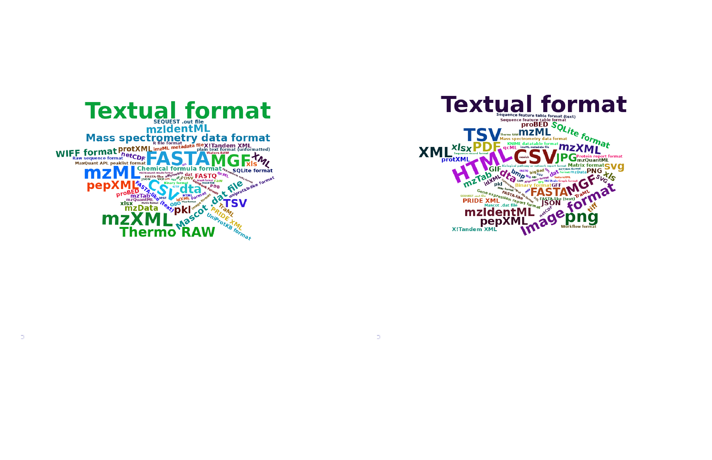
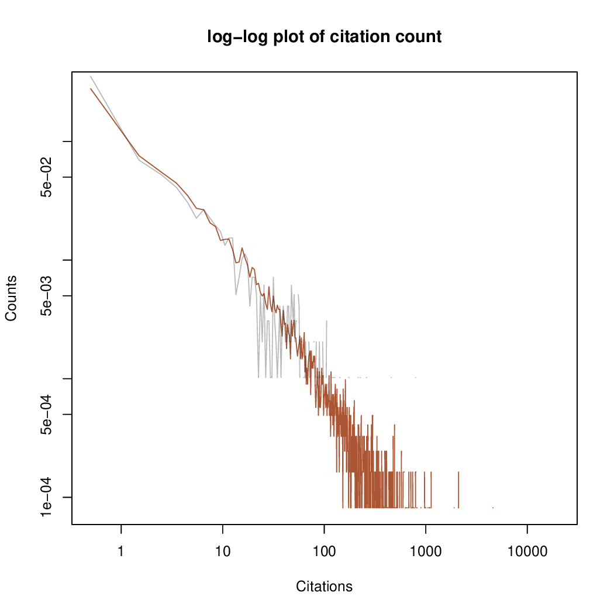
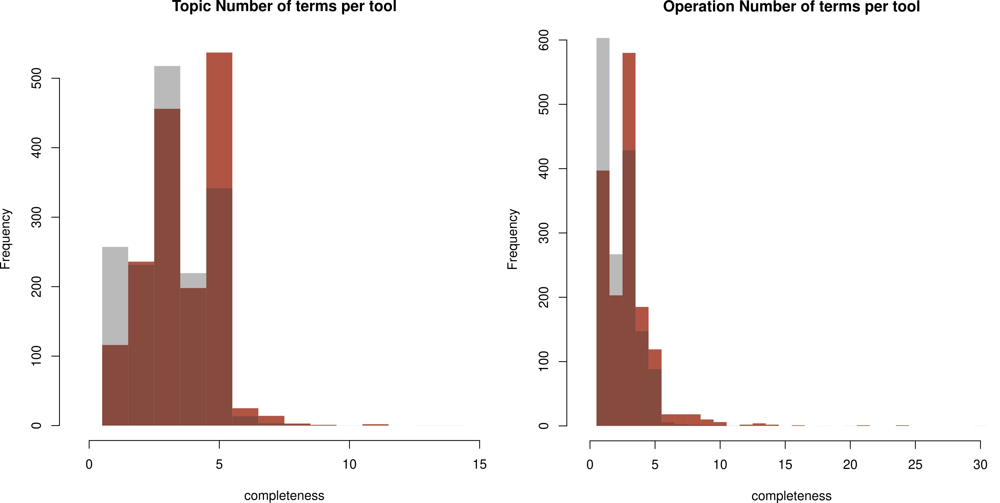

<!--

The paper.md, bibtex and figure file can be found in this repo:

  https://github.com/journal-of-research-objects/Example-BioHackrXiv-Paper

To modify, please clone the repo. You can generate PDF of the paper by
pasting above link (or yours) in

  http://biohackrxiv.genenetwork.org/

-->

# Introduction

With 20.000+ entries, bio.tools is a major registry of computational tools in the life sciences. During the [2021 European BioHackathon](https://biohackathon-europe.org/), the project "Making bio.tools fit for workflows" was run to  address two urgent needs of the platform:

1. Slicing the bio.tools content through specialisation and categorisation, to improve exposure to communities and to present useful content for the users. The main challenge is to summarise relevant information from the wealth of annotation categories in bio.tools and metrics from external sources. Therefore we aim to enrich tools, communities and collections with statistics and metrics that summarise functionality, impact and annotation quality. These metrics and statistics are valuable resources for tool-building communities, scientific domains, individual scientific tool repositories and groups specialising in technical features. With that information, we can identify, calculate and integrate metrics relevant for the bio.tools registry. In addition we will devise a mock-up / alpha version summary stats page within bio.tools.

2. Improving the quality of functional tool annotations, to enable automated composition of individual tools into multi-step computational pipelines or workflows. Currently, tool annotations are often incomplete or imprecise, hampering plug&play workflow composition. We will develop a protocol for improving functional tool annotations in bio.tools. It will be based on 1) selecting reference workflows from workflow repositories and literature, 2) trying to recreate them using bio.tools and the Automated Pipeline Explorer, 3) comparing automatically created and reference workflows, and 4) if necessary revising the tool annotations until recreation succeeds. Workshop participants will perform this process and concurrently develop the tooling and documentation to enable its application to additional workflows after the hackathon.

The outcomes of this project will make software more findable and provide a solid basis for iteratively improving the quality of functional annotations in bio.tools, making it an increasingly powerful source of new fit-for-purpose workflows.

In this document we document the progress towards these goals that was made during the BioHackathon 

# Hacking Activities and Outcomes

## bio.tools Stats and Figures

(please add content here)

### General statistics on bio.tools collections
General trends and properties within a tool collection. The main use case discussed here consists of the tools withe an EDAM topic _Proteomics_. 

#### EDAM

Word clouds provide an overview of the different terms and their frequency.

Differences between _input_ and _output_ data:

as well as between _input_ and _output_ formats:

#### Other terms

We can monitor statistics on tool type, operation system and license

#### Metrics

Availability of code monitored by OpenEBench:

More stats from Europe PMC, counting citations of the main publications of the tools

{: style="background-color:white;"}

Here, red is the distribution of about 50% of all bio.tools tools, grey the publications of proteomics tools.

## bio.tools Annotation Quality

In order to asses the quality of bio.tools annotation, we have decided to distinguish few different aspects of evaluation:

How well are the tools annotated in comparison with all annotations in bio.tools (red: proteomics tools, grey: all):

In general, proteomics have more EDAM annotations (also counts for _Data_ and _Format_).

#### Availability of inputs/outputs

One of the straight-forward criteria for accessing the quality of annotation is distinguishing tools that include input/output pairs, and those that do not. We observe that ~7,6% (1721/22540) of the tools provide the input/output annotations with both, data type and format specified, while the others lack at least one of the mentioned annotations. In addition, we can see that the percentage changes within different domains,/topics, which does not come as a surprise. Where the domains such as 'proteomics' include ~36,4% (273/751) of the fully annotated tools, with respect to the input/output annotations.

(to add figure)

#### "IO concreteness" - specialisation of input/output annotation terms (this name is a placeholder)

When looking at tools that have annotated inputs and outputs, we try to asses the "IO concreteness" of tool annotations by evaluating how specific the terms used to specify the inputs and outputs are, i.e., whether the terms are abstract classes - low "IO concreteness", or concrete concepts (usually leaves) - high "IO concreteness". We noticed that overall "IO concreteness" of inputs is slightly higher than the outputs, i,e., the terms used for input annotations are more specific/concrete than the terms used for output. Furthermore, the **data formats** of both, inputs and outputs, have higher "IO concreteness" than **data types**. As a matter of fact over 20% of the input/output annotations are annotated as **Data**, which is the root term of the corresponding taxonomy. 

(to add figure maybe)

### bio.tools Automated Annotation Improvement

The results of the evaluation of the "IO concreteness" of bio.tools suggest that there is space for improvement when to comes to **data types** annotations of the operation inputs/outputs.

We use existing EDAM object properties to attempt to automatically improve the corresponding bio.tools annotations. We identify three key object properties, as follows:
- **is_format_of** - defines dependency between data *formats* and corresponding data *types*
- **has_input** - defines dependency between *operation* and corresponding data *type* inputs
- **has_output** -  defines dependency between operation and corresponding data *type* outputs

We focus on the **is_format_of** as part of the preliminary approach, with plan to extend it to all 3 concepts. The results show that out of 1721 operations, there are 443 inputs and outputs, where data type suggested by EDAM ontology (based on the given format and *is_format_of* object property) is more concrete than the one annotated in bio.tools (see [file](http://https://github.com/bio-tools/biohackathon2021/blob/main/JavaVedran/biotoolsAnnotations/res/Results/toolAnnotationFullBioTools_suggestions.csv "file")). When looking at the *proteomics* domain, there are 16 inputs and outputs (out of 273 operations) where data type suggested by EDAM ontology (based on the given format and *is_format_of* object property) is more concrete than the one annotated in bio.tools (see [file](https://github.com/bio-tools/biohackathon2021/blob/main/JavaVedran/biotoolsAnnotations/res/Results/toolAnnotationProteomics_suggestions.csv "file")). 

## Use Case: The Cascabel Pipeline

Based on [@cascabel], content to be added

# Discussion

....

## Acknowledgements

We thank the organizers of the BioHackathon Europe 2021 for travel support for some of the authors.

## References
